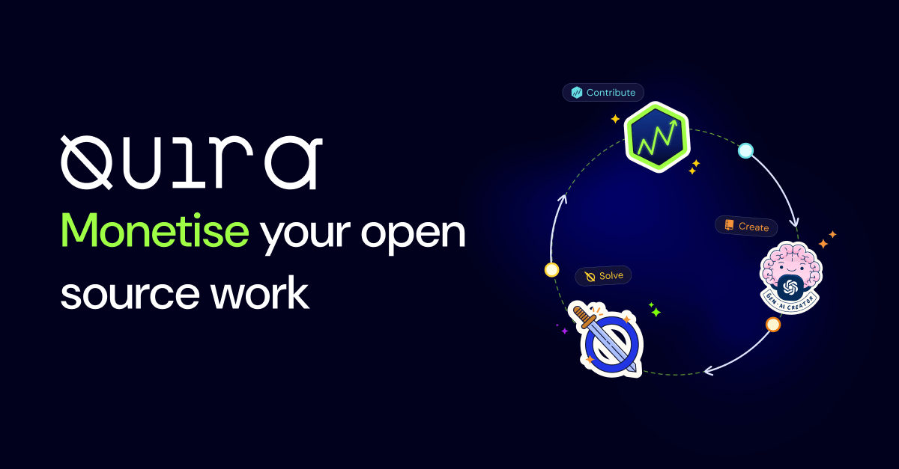

Tik tok... Knock knock... Who's on the door? It's **Quira**. 🚀

But why Quira??? After walking miles barefooted, I found something that might `fix: thirst of all open-source enthusiasts`. So, without wasting time, let me open the PR(pull request) so that the reviewers(you) can give suggestions, if any and quickly merge it!

&nbsp;

## What is [Quira](https://quira.sh/)❓
Quira is an organization designed in London and built remotely. It helps developers build and monetise their skill sets by completing quests on GitHub. You can earn rewards and develop new skills by contributing to open source or creating new projects.

For Developers, Quira offers two features:
    1. Devrank
    2. Quests

_Reputation quantification in Quira_

DevRank in Quira is the first reputation metric and is a function of two types of reputation-flows in the GitHub ecosystem. Intuitively, it captures the impact that you've had on the growth of open-source projects. It takes into consideration how and when you contributed to popular repos, and the DevRank of the people that starred or imported those repos. A higher value means more reputation.

Check the below screenshot as an example:

<figcaption>Devrank Leaderboard</figcaption>

&nbsp;
Check your devrank here: https://quira.sh/leaderboards
&nbsp;

### Quests ⚒️
_Quira Quests allow you to earn rewards for your open source contributions 💸_

[Quira Quests](https://quira.sh/quests) are paid coding challenges that take the form of contribution opportunities orchestrated by commercial open-source software (OSS) organizations.

Quira offers two types of Quests - Creator Quest & Solver Quest.

- **🧑‍💻 Creator Quest**:
A Creator Quest is a special type of coding challenge that _rewards software developers for their creativity and ideas_.

&nbsp;
Link to Creator Quest: https://quira.sh/quests/creator

<figcaption>Creator Quest Image</figcaption>

&nbsp;

- **💃 Solver Quest**:
A Solver Quest is a special type of coding challenge that rewards software developers for _resolving open Issues in the OSS organization's GitHub repositories_. `Solver Quests are accessed by invitation`. The Issues you will typically be invited to help solve will be matched against your abilities based on your prior contributions.

&nbsp;
Link to Solver Quest: https://quira.sh/quests/solver/join

<figcaption>Solver Quest Image</figcaption>

&nbsp;

## Just a little more... 😜
Quira is awesome, supportive, and educational. You can learn many things from the Quests. Still have trust issues? Aah! Wait let me send me my own dashboard screenshot to you. 😑

<figcaption>My Dashboard @RohanSrma</figcaption>

&nbsp;

This is what it looks like, now I have a balance of 83 USD on my account./. which I can claim anytime. 💸

> NOTE: You must have a value **greater than or equal to 50 USD** present to withdraw your amount!

And wait wait wait... I forget to tell you something. For making a valid submission in the creator quest, you'll be awarded a special badge which has its unique identity! That's super cool 🎉

If you want to join the Quira Discord Community, here's the link: https://discord.gg/ytuyspRB

Thanks for the time you gave in reading this post 💝! Be blessed always. Good forces on your side. Thank you 🥰
