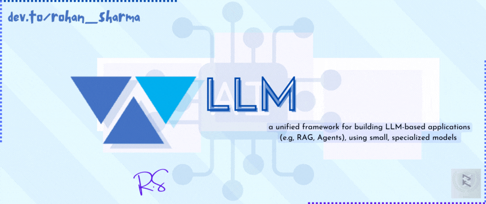

# LLMware.ai 🤖: An Ultimate Python Toolkit for Building LLM Apps



Welcome to the world of AI 🚀! According to John McCarthy (father of AI)
> "Artificial intelligence (AI) is the science and engineering of making intelligent machines, especially intelligent computer programs".

As a developer, you're always on the lookout for tools that make your life easier, faster, and more efficient. Today, I came up with something interesting that will awaken your interest, too!!! 😉

3️⃣... 2️⃣... 1️⃣... 🏹

## Introducing [LLWare.ai](https://github.com/llmware-ai/llmware) 🤖
`llmware` is an integrated framework with over 50+ small, specialized, open-source models for quickly developing LLM-based applications including Retrieval Augmented Generation (RAG) and Multi-Step Orchestration of Agent Workflows.


Here's how LLMWare defines itself,
> llmware provides a unified framework for building LLM-based applications (e.g., RAG, Agents), using small, specialized models that can be deployed privately, integrated with enterprise knowledge sources safely and securely, and cost-effectively tuned and adapted for any business process.

LLMWare specifically focuses on making it easy to integrate open-source small specialized models and connecting enterprise knowledge safely and securely.


<figcaption> LLMWare Main Components </figcaption>

&nbsp;

**LLMWare Github Repo**: _https://github.com/llmware-ai/llmware_ (star it ⭐)
**LLMWare Official Website**: _https://llmware.ai/_

&nbsp;

## How to Install LLMWare.ai ⚒️
### Using pip install: the developer's choice
Pip makes the installation easier, just write the below code in your terminal:
```
pip3 install llmware
```
### Cloning the Repo
```
git clone git@github.com:llmware-ai/llmware.git
```
After cloning the repo, llmware provides a short ‘welcome to llmware’ automation script, which can be used to install the projects requirements.
- for Windows users
 ```
 .\welcome_to_llmware_windows.sh
 ```
- for Mac users
 ```
 sh ./welcome_to_llmware.sh
 ```
Alternatively, if you prefer to complete the setup without the welcome automation script, then the next steps include:
1. install requirements.txt
2. install requirements_extras.txt
3. run examples
4. install vector db
5. Pytorch 2.3 note
6. Numpy 2.0 note

You can read about the installation steps by directly clicking on the link: [LLMWare Setup Guidelines](https://github.com/llmware-ai/llmware?tab=readme-ov-file#%EF%B8%8F-working-with-the-llmware-github-repository)

&nbsp;

## A Quick Project with LLMWare 🧑‍💻
Before explaining other stuff about llmware, let's witness its power first. Go through this quick project and get to know how llmware exactly works.

We are going to create a **GGUF Streaming Chatbot** using llmware and streamlit:
- Locally deployed chatbot using leading open-source chat models, including Phi-3-GGUF
- Uses Streamlit
- Core simple framework of ~20 lines using llmware and Streamlit.
- run without Wifi

### So let's start 🟩:
1️⃣ Install the `llmware` as explained above. Or simply run this code in the terminal:
 ```
 pip3 install llmware
 ```
2️⃣ Install the `streamlit` by running the below code in the terminal again:
 ```
 pip3 install streamlit
 ```
3️⃣ Make a Python file, let's say ggfu_streaming_chatbot.py, and paste the below code:
```py
import streamlit as st
from llmware.models import ModelCatalog
from llmware.gguf_configs import GGUFConfigs

GGUFConfigs().set_config("max_output_tokens", 500)


def simple_chat_ui_app (model_name):

    st.title(f"Simple Chat with {model_name}")

    model = ModelCatalog().load_model(model_name, temperature=0.3, sample=True, max_output=450)

    # initialize chat history
    if "messages" not in st.session_state:
        st.session_state.messages = []

    # display chat messages from history on app rerun
    for message in st.session_state.messages:
        with st.chat_message(message["role"]):
            st.markdown(message["content"])

    # accept user input
    prompt = st.chat_input("Say something")
    if prompt:

        with st.chat_message("user"):
            st.markdown(prompt)

        with st.chat_message("assistant"):

            #   note that the st.write_stream method consumes a generator - so pass model.stream(prompt) directly
            bot_response = st.write_stream(model.stream(prompt))

        st.session_state.messages.append({"role": "user", "content": prompt})
        st.session_state.messages.append({"role": "assistant", "content": bot_response})

    return 0


if __name__ == "__main__":
    #   note: will take a minute for the first time it is downloaded and cached locally

    chat_model = "phi-3-gguf"
    
    model_name = chat_model

    simple_chat_ui_app(model_name)
```
4️⃣ Move to the terminal again and run the below code to run the application:
```
streamlit run ggfu_streaming_chatbot.py
```

### Output 📃


<figcaption> Example Search to Test the Project </figcaption>

&nbsp;

Now you might be wondering, what's just happened right now! I know-I know that's harder to digest. You may have many questions but adding all the things in the blog makes it long and a bit confusing. But wait! I have that explanation part. Kindly go through the video once:




## Supported Vector Databases 🛅
Integrate easily with vector databases for production-grade embedding capabilities.
LLMWare supports: `FAISS`, `Milvus`, `MongoDB Atlas`, `Pinecone`, `Postgres (PG Vector)`, `Qdrant`, `Redis`, `Neo4j`, `LanceDB`, and `Chroma`.

Just for example, if you want to use vectors like SQLite3 and ChromaDB (File-based) where no install is required, you can use the below code:
```py
from llmware.configs import LLMWareConfig 
LLMWareConfig().set_active_db("sqlite")   
LLMWareConfig().set_vector_db("chromadb")
```

That's it! You just need to make this much effort and you'll be good to go! 🥰

&nbsp;

## LLMWare Hugging Face Models 🫂


<figcaption> Hugging Face Models List </figcaption>

&nbsp;

You can explore the models on the official hugging face site, Find the link here: [LLMWare Hugging Face Models](https://huggingface.co/llmware)

&nbsp;

## LLMWare as Closed-Source 🐍
Till now I have discussed the `llmware` open-sourced version, but that's not the limitation! `llmware` also provides a paid version which you can use to save a lot of time for your enterprise. LLMWare provides small models, you can call them SLMs (Small Language Models) which are way better than LLMs, as no or less GPU is required to run these models.


<figcaption> Features Provided in Closed-Source Version </figcaption>

&nbsp;

## Moving to the end... 🥹
Thanks for reading it patiently. I appreciate your patience and love for me. Before thanking you note, I want to brief this awesome product.

**_LLMWare is the ultimate toolkit for building LLM apps - No GPU Required_**. That's the most interesting thing about llmware. Also, the closed source version of the llmware provides you with all the things an enterprise may need in one place (of course, I'm talking about AI features and handling).

If you still have any questions, drop it in the comment section. Alternatively, you can join the _LLMWare Official Discord Channel_ by following this link: https://discord.com/invite/fCztJQeV7J

Here's the link to get all the example use cases of LLMWare OS version: https://llmware-ai.github.io/llmware/examples

That's all for today. Thanks for your time. You're amazing! Have a good day. 💝

 Star LLMWare on Github ⭐ 