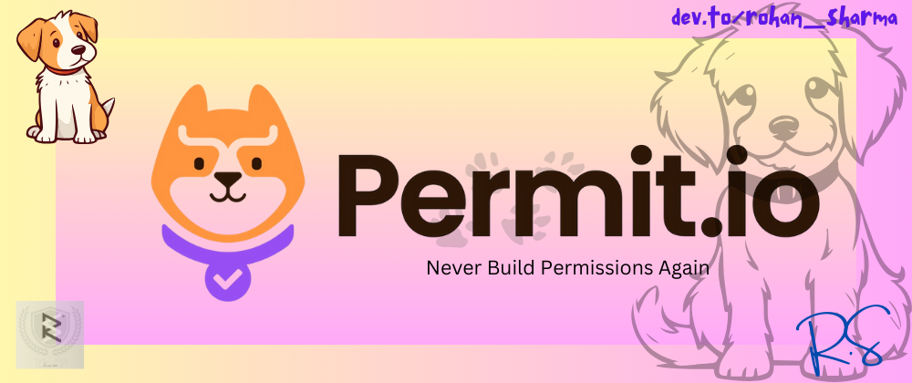

# Add an authorization layer to your app with Permit.io🔏 in a few minutes ⏱️



Struggling with writing permissions and authorization codes?? Feeling sad for you man! I was too struggling with this until I got to know about the Permit.io 🥹

In this blog, I'm going to cover some basics of Permit and how it can smoothly handles the authorization part of your application.

But before starting, let's know "_What is Authorization?_" first.
 Authorization (abbreviated as `AuthZ`) is the critical and most advanced part of Identity Access Management (IAM). It controls access within a product. This is where you most often run into roles, permissions, ownership, application users, invites, approval flows, and many more common patterns. You can read more about [Authorization](https://www.permit.io/blog/what-is-authorization), by going to the official blog shared by the founder of Permit.

&nbsp;

## Understanding [Permit.io](https://www.permit.io/) 🔏
Authorization is the need of every application. Without authZ, your application doesn't have control access within many parameters, making it unsafe. 🔑

Authorization plays the crucial role of ensuring that the right people and services have the right access to the right resources. _Permit allows you to **decouple your authorization policy and application code**, providing you with everything you need to create the perfect authorization layer for your application_ - A centralized control panel, SDKs, APIs, and microservice for authorization. These allow you to easily set up decision and enforcement points within your application. The good thing about it is all authorization decisions are made on your side with zero latency.

 🧑‍💻_Permit’s cloud service provides you with a **full set of no-code tools**_ that allow you, as well as every relevant person in your organization (e.g., product, security, support, or sales), to manage authorization within your application securely, with zero coding knowledge required.

🍩 _Permit provides you with a **full set of pre-built UI components**_ that provide fully functional access control, allowing you to safely delegate them to your end users.

👷‍♂️ Policy models such as ABAC (Attribute-based Access Control) and ReBAC (Relationship-based Access Control), or even a combination of both of them are now really **easy to configure** with Permit.io.


<figcaption> All your access control needs in one place </figcaption>

&nbsp;

## A Quick Tutorial of Permit.io 🧑‍💻
Ready to be hands-on with Permit to add authorization to your applications? In this tutorial, we will be integrating Permit.io into your application within a few steps.

Before starting, please make an account in Permit.io so that you'll be able to get your API key and access the Permit.io dashboard where you assign roles to ppl as per your choice and decision. If you're facing any problems, click on this link for a quick guide: [Setting up your account with Permit](https://docs.permit.io/quickstart/)


1️⃣ **Get your Permit Environment API Key**


> You can also copy the Environment API Key of the active environment by clicking on the User Menu > Copy Environment Key

2️⃣ **Setup your PDP (Policy Decision Point) Container**
The PDP functions as your microservice for authorization and is provided as a docker container ready for you to use, or as a cloud version for quick experimentation.

We will be using Docker Container for this.

- Pull the Permit.io Image (assuming you have Docker installed, if not [click to install](https://docs.docker.com/get-started/get-docker/))
  ```docker
  docker pull permitio/pdp-v2:latest
  ```
- Replace the API key with your key in the below command
  ```docker
  docker run -it -p 7766:7000 --env PDP_DEBUG=True --env PDP_API_KEY=<YOUR_API_KEY> permitio/pdp-v2:latest
  ```
- Now, your PDP container is running, Use the below command to check or verify the running container.
  ```docker
  docker ps
  ```

3️⃣ **It's time to add Permit.io to your app!** 
We will be using Permit SDK for this. You can integrate Permit.io for a wide variety of coding languages.


<figcaption> Languages available </figcaption>

_For this tutorial, we will be going to use nodeJs Sdk_.
- Install the Permit.io SDK
  ```
  npm install permitio
  ```
- Import the SDK into your code
  ```js
  import { Permit } from "permitio";
  ```
- Create a new instance of the SDK.
  ```js
 // This line initializes the SDK and connects your Node.js app
 // to the Permit.io PDP container you've set up in the previous step.
 const permit = new Permit({
   // your API Key
   token: "[YOUR_API_KEY]",
   // in production, you might need to change this url to fit your deployment
   pdp: "http://localhost:7766",
   // if you want the SDK to emit logs, uncomment this:
   // log: {
   //   level: "debug",
   // },
   // The SDK returns false if you get a timeout / network error
   // if you want it to throw an error instead, and let you handle this, uncomment this:
   // throwOnError: true,
 });
 ```
  > I hope you don't face any problems in adding the API key now 😉

4️⃣ **Check for permissions using the SDK**
You can run a permission check with `permit.check()`, passing in 3 arguments:
 1. `user`: a unique string id that identifies the user doing the action. This is typically the user key.
 - `action`: the action performed.
 - `resource`: the resource (object) the action is performed on.

```js
const permitted = await permit.check("rohan@xyz.co", "modify", "document");
if (permitted) {
  console.log("Rohan is PERMITTED to modify a document");
} else {
  console.log("Rohan is NOT PERMITTED to modify a document");
}
```
<figcaption> user: Rohan, action: modify, Resource: Document </figcaption>

> Usually instead of an email you'd use the unique identifier provided by your chosen authentication solution.

In cases where you are dealing with more than one tenant in your application, `permit.check()` can pass the tenant as part of the resource.

The tenant passed in needs to be either the `tenant id` or the `tenant key`. [List of All Tenant API](https://api.permit.io/v2/redoc#tag/Tenants/operation/list_tenants)

Example:
```js
const permitted = await permit.check(
  // the key of the user
  "rohan@xyz.co",
  // the action
  "modify",
  {
    type: "document",
    tenant: "permit_io",
  }
);
```

You can also **check the permission against the ABAC Policy**. An [ABAC Policy](https://docs.permit.io/how-to/build-policies/abac/components/#what-makes-up-an-abac-policy) is made up of User Sets and Resource Sets.

If we are running a `permit.check()` for an ABAC policy, we can attach _just-in-time attributes_ to the `user` and the `resource`. These attributes are merged (and overridden) user and resource attributes that were persisted to the permitted API.

```js
const permitted = await permit.check(
  // the user object
  {
    // the user key
    key: "check@permit.io",
    // just-in-time attributes on the user
    attributes: {
      location: "India",
      department: "Engineering",
    },
  },
  // the action the user is trying to do
  "action",
  // Resource
  {
    // the type of the resource (the resource key)
    type: "resource",
    // just-in-time attributes on the resource
    attributes: {
      hasApproval: "true",
    },
    // the tenant the resource belong to
    tenant: "tenant",
  }
);
```

5️⃣ **Full Application Example**:
```js
const { Permit } = require("permitio");

const express = require("express");
const app = express();
const port = 4000;

// This line initializes the SDK and connects your Node.js app
// to the Permit.io PDP container you've set up in the previous step.
const permit = new Permit({
  // in production, you might need to change this url to fit your deployment
  pdp: "http://localhost:7766",
  // your secret API Key
  token: "[YOUR_API_KEY]",
});

// You can open http://localhost:4000 to invoke this http
// endpoint, and see the outcome of the permission check.
app.get("/", async (req, res) => {
  // Example user object
  // You would usually get the user from your authentication layer (e.g. Auth0, Cognito, etc) via a JWT token or a database.
  const user = {
    key: "[A_USER_ID]",
    firstName: "John",
    lastName: "Smith",
    email: "john@permit.io",
  };

  // check for permissions to a resource and action (in this example, create a document)
  const permitted = await permit.check(user.key, "create", "document");
  if (permitted) {
    res.status(200).send(`${user.firstName} ${user.lastName} is PERMITTED to create document!`);
  } else {
    res.status(403).send(`${user.firstName} ${user.lastName} is NOT PERMITTED to create document!`);
  }
});

app.listen(port, () => {
  console.log(`Example app listening at http://localhost:${port}`);
});
```

_Navigate to the **[Audit log page](https://app.permit.io/audit-log)** to see your permissions request results._

> _If you want to run this tutorial in your comfortable language or want to test Permit.io in other languages_, head over to this link: **[Select Your Language](https://docs.permit.io/overview/connecting-your-app/#select-your-language)**

&nbsp;

## Concludingggg... 🥹
_Permit is a full-stack authorization-as-a-service solution that will enable you to apply secure, granular, and user-friendly permission management._

The [Permit Slack Community](https://permit-io.slack.com/join/shared_invite/zt-nz6yjgnp-RlP9rtOPwO0n0aH_vLbmBQ#/shared-invite/email) is a great place to get help with planning your implementation, using Permit features, or any other related questions you might encounter

In the part II of this blog, I'll talking about OPAL- Open Policy Administration Layer (OPAL) which is an open-source project developed and maintained by the Permit.io team. It serves as an administration layer for Policy Engines, detecting changes to both policy and policy data in real time and pushing live updates to your agents.

Permit.io Official Website: https://www.permit.io/
Permit.io Official Docs: https://docs.permit.io/quickstart

Thanks for reading till here! You are awesome. Have a productive day. 💖