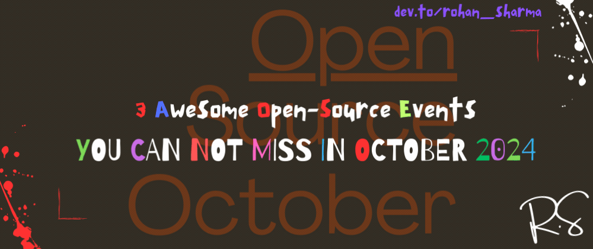

# Top 3 Open-Source Events that will make your October memorable!

October is often called the month of Techies. It brings many joys in a programmer's life through the various Open-Source events. It's a swag month for me. For others, it's a month to meet amazing new people, get more involved with the open-source community, and learn a lot!

In this blog, I'll be covering the top 3 Open-Source Events that will make your October memorable.

So, are you ready to get some swags????

&nbsp;

## Number 1️⃣: [DevFest AI](https://devfest.ai/) 🤖
_Contribute code to AI repositories, meet new people, Participate in events, and win awesome SWAG._

<figcaption> Offical DevFest AI Landing Page </figcaption>

[DevFest AI](https://devfest.ai/) is a month-long Open-Source event where you'll learn new technologies, facilitate connections with new community members, and win awesome Swag from their sponsors.

- It's a team event. You can have a max of 5 people in your squad. 
- Registration is open! The event will start between 1st - 31st October 2024.
- You have to contribute to AI repositories. 🤖
- The top 20-30 squads (numbers may increase) will win awesome swag! (each swag to each member of a squad).
- Month-long events and giveaway plans to keep you ~~updated~~ swag-dated!

### How to Register??
If you don't have a [GitHub](https://github.com/) account, make one.

Here's the registration link: https://devfest.ai/, open it and then simply click on the `Sign Up With GitHub` button, authorize yourself, and you're done with the registration process.

After registration, either `create a team`, if you have any, or click on `join a team`, which will add you to a random group. After joining/forming a team, you'll also be also to talk to your teammates in real time!

So, what are you waiting for???
Create your custom [ticket](https://devfest.ai/ticket/) now, and share it on X (formerly Twitter) to **take part in the giveaway** 🎁. Results will be out post-program. Make sure you tag them on social media so they can find your ticket.

<figcaption> DevFest AI Ticket </figcaption>

Still, have questions?? Head over to the FAQ section: https://devfest.ai/#faq

 Register Now 🚀 

&nbsp;

## Number 2️⃣: [Quira Hacktoberfest](https://discord.gg/UEN5QDKh)🧑‍🤝‍🧑
_A fest that every creator wants._

If you don't know much about Quira, read my blog: [What is Quira?](https://dev.to/rohan_sharma/quira-monetise-your-open-source-work-10e3)

[Quira Hactoberfest] is a month-long Open-Source event where you'll not only be able to participate but can also see your standing at the [global leaderboard](https://quira.sh/hacktoberfest?type=orgs) provided by them.

- It's a solo event.
- Registration will be opening soon! The event will start between 1st - 31st October 2024 (most probably).
- You have to contribute to any repositories listed on the Quira website.
- The top 50 contributors will be awarded.
 - Here are the Prizes given out based on your ranking (last year stats, it's going to be changed!!! 🤩 More swags on the way):
  - 1st to 10th place: Gold Merch pack, including Tee Shirt, a Cap and Stickers (🧢 + 👕+ 🗒️)
  - 11th to 25th place: Silver Merch pack, including a Cap and Stickers (🧢 + 🗒️ )
  - 26th to 50th place: Bronze Merch pack, including Stickers ( 🗒️ )

**Quira Hacotberfest Preptember**
Preptember is in and Quira has a great line-up of quests!

<figcaption> list of preptember events </figcaption>

You can get the link here to join the Quira Preptember Fest: https://quira.sh/quests/creator

### How to Join??
For now, just join Quira's discord channel: https://discord.gg/UEN5QDKh and be attentive to the announcement section.

 Quira Discord 🚀 

&nbsp;

## Number 3️⃣: [Hacktoberfest](https://hacktoberfest.com/) 🎃
_A month-long celebration of all things open-source_

<figcaption> Offical Hacktoberfest Landing Page </figcaption>

[Hactoberfest](https://hacktoberfest.com/) is also month-long Open-Source program and the most awaited program for all the open-source enthusiasts present all around the Globe! Hacktoberfest is one of the best events for a newbie to learn about open-source and how it works.

- It's a solo event.
- Registration starting from September 23, 2024! The event will begin on 1st October 2024.
- There was no in-hand swag last year. but we got some cool Holopin badges and a tree was planted by our name. Maybe this year, something more interesting thing coming. Though you can earn many swags through Hacktoberfest, as many organizations such as [DocsGPT](https://github.com/arc53/DocsGPT), [trigger.dev](https://github.com/triggerdotdev/trigger.dev), [Odigos](https://github.com/odigos-io/odigos), and [Illa](https://github.com/illacloud/illa-builder) provide swags if you contribute to their repo. (conditions applied)
- Month-long events and learning opportunities.

**Hacotberfest Preptember**
September is prep time for Hacktoberfest. Spend September getting a jump start on your four pull/merge requests by tracking down projects to contribute to, adding the ‘hacktoberfest’ tag to your own projects, or familiarizing yourself with Git so you can hit the ground running when Hacktoberfest begins on October 1.

### How to Participate??
If you don't have a [GitHub](https://github.com/) account, make one.

And then go through this link: https://hacktoberfest.com/participation/

Isn't it cool? Having a tree by your name?? This is how Hacktoberfest made us feel awesome and always memorable! 🪴

Still, have questions?? Head over to the About section: https://hacktoberfest.com/about/

 Hactoberfest Countdown 🚀 

&nbsp;

## Number 4️⃣: [HackSquad](https://www.hacksquad.dev/)🧑‍🤝‍🧑 (may not happen this time)
_Contribute code, meet community members, participate in workshops, and win more SWAG._

<figcaption> Offical HackSquad Landing Page </figcaption>

[HackSquad](https://www.hacksquad.dev/) is a month-long Open-Source event where you'll enhance your OS performance, meet with more community members, participate in workshops from our great sponsors, and a lot of Swags.

- It's a team event as same as DevFest. You can have a max of 5 people in your squad.
- Registration will be opening soon! The event will start between 1st - 31st October 2024.
- You have to contribute to any repositories having 200 or above stars (as per the last year, this rule may change).
- The top 60 squads (numbers may vary) will win awesome swag! (each swag to each member of a squad)
- Month-long events and giveaway plans to keep you ~~updated~~ swag-dated!

### How to Register??
If you don't have a [GitHub](https://github.com/) account, make one.

Here's the website link: https://www.hacksquad.dev/, Once registration is started, I'll update this blog. However, the registration steps are the same as explained in DevFest. Just open the official link and, then click on the `Sign Up With GitHub` button, authorize yourself, and you're done with the registration process.

After registration, either `create a team`, if you have any, or click on `join a team`, which will add you to a random group.

If you still have questions, head over to **Q&A section** of last year: https://www.hacksquad.dev/#qa

My last year's HackSquad Experience:

> P.S.: _HackSquad has been happening for the past two years, while DevFest is happening for the 1st time. Both assemble very much similarities in their rules and code of conduct, but they are not the same_.

 Visit HackSquad 🚀 

&nbsp;

## Moving to the end... 🥹
I don't know you're excited or not, but I'm very much excited!

The only Prerequisite is you must know "how to make open-source contributions?". Otherwise, you won't be able to do anything. I'll be writing a blog on it soon, but before that, go through the video that will tell you the basics of open-source contributions. This video is made by me and I tried to explain in as short as I could!



And please, try not to exploit the open source with bad codes or meaningless codes./.

Have a good day. All good forces on your side. Thanks for reading 💖